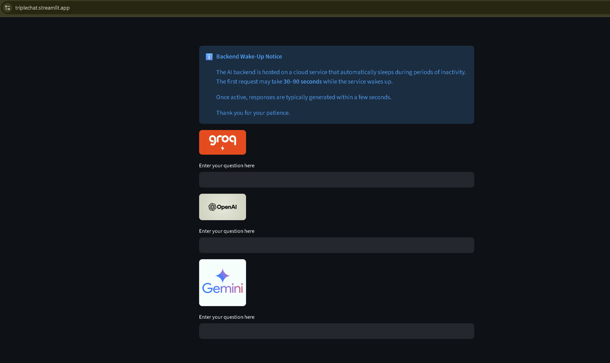

# LangServe-based LLM AI Chatbot

## Overview

This project provides a FastAPI backend with LangServe routes for three LLM providers:

* Groq
* OpenAI
* Google Gemini

A Streamlit frontend sends user questions to the backend and displays the generated responses.

The backend exposes separate LangServe endpoints for each model provider.

## Application Screenshot


## Features

* FastAPI backend
* LangServe integration
* Groq chatbot using `openai/gpt-oss-120b`
* OpenAI chatbot using `gpt-4o`
* Google Gemini chatbot using `gemini-2.5-flash`
* Common prompt template for all three models
* `/health` endpoint for backend health checks
* Streamlit frontend
* Pytest API tests
* GitHub Actions CI
* Render deployment support

## Tech Stack

* **Python 3.11** — application runtime
* **FastAPI** — backend API
* **LangServe** — exposes LangChain chains as API routes
* **LangChain** — prompt and model integration
* **Groq** — `openai/gpt-oss-120b`
* **OpenAI** — `gpt-4o`
* **Google Gemini** — `gemini-2.5-flash`
* **Streamlit** — frontend
* **Pydantic** — request validation
* **Pytest** — API testing
* **GitHub Actions** — CI
* **Render** — backend hosting

## Project Structure

```text
2_chatapp_sep2026_hosted/
│
├── .github/
│   └── workflows/
│       └── ci.yml
│
├── backend/
│   └── main.py
│
├── frontend/
│   └── app.py
│
├── tests/
│   └── test_api.py
│
├── .env
├── .gitignore
├── LICENSE
├── README.md
└── requirements.txt
```

## Requirements

* Python 3.11
* Groq API key
* OpenAI API key
* Google API key

The application loads environment variables from the `.env` file located in the project root.

Required variables:

```text
GROQ_API_KEY=your_groq_api_key
OPENAI_API_KEY=your_openai_api_key
GOOGLE_API_KEY=your_google_api_key
```

Do not commit `.env` or API keys to GitHub.

## Installation

Clone the repository:

```bash
git clone https://github.com/learnermp09/2_chatapp_sep2026_hosted.git
```

Move into the project directory:

```bash
cd 2_chatapp_sep2026_hosted
```

Create a Python 3.11 virtual environment:

```bash
python -m venv venv
```

Activate it on Windows:

```bash
venv\Scripts\activate
```

Upgrade pip:

```bash
python -m pip install --upgrade pip
```

Install the required packages:

```bash
pip install -r requirements.txt
```

Create a `.env` file in the project root:

```text
GROQ_API_KEY=your_groq_api_key
OPENAI_API_KEY=your_openai_api_key
GOOGLE_API_KEY=your_google_api_key
```

## Running the Backend

From the project root, run:

```bash
uvicorn backend.main:app --reload
```

The local backend will be available at:

```text
http://127.0.0.1:8000
```

The root endpoint can be checked at:

```text
http://127.0.0.1:8000/
```

Expected response:

```json
{
  "message": "LLM chatbot API is running"
}
```

The health endpoint is:

```text
http://127.0.0.1:8000/health
```

Expected response:

```json
{
  "status": "healthy"
}
```

## API

The application exposes three LangServe routes.

### Groq

```text
POST /chatgroq/invoke
```

Request:

```json
{
  "input": {
    "question": "What is 1+2?"
  }
}
```

### OpenAI

```text
POST /chatopenai/invoke
```

Request:

```json
{
  "input": {
    "question": "What is 1+2?"
  }
}
```

### Google Gemini

```text
POST /chatgeminiai/invoke
```

Request:

```json
{
  "input": {
    "question": "What is 1+2?"
  }
}
```

The LangServe response contains the generated answer in the `output` field:

```json
{
  "output": "3"
}
```

## Running the Streamlit Frontend

The frontend is in:

```text
frontend/app.py
```

Run it from the project root:

```bash
streamlit run frontend/app.py
```

The Streamlit application sends requests to the deployed backend configured in `frontend/app.py`.

The current backend URL is:

```text
https://two-chatapp-sep2026-hosted.onrender.com
```

The frontend provides separate input fields for:

* Groq
* OpenAI
* Gemini

## Testing

Run all tests from the project root:

```bash
python -m pytest -v -s
```

The tests send requests to:

```text
/chatgroq/invoke
/chatopenai/invoke
/chatgeminiai/invoke
```

Each test checks that the API returns HTTP status `200` and contains a non-empty `output` field.

The tests require valid API keys because they call the configured LLM providers.

## Continuous Integration

GitHub Actions runs on:

* Pushes to `main`
* Pull requests targeting `main`

The workflow in `.github/workflows/ci.yml`:

1. Checks out the repository.
2. Sets up Python 3.11.
3. Installs `requirements.txt`.
4. Checks Python syntax using `compileall`.
5. Runs the Pytest test suite.

The following GitHub Actions secrets are required for the tests:

```text
GROQ_API_KEY
OPENAI_API_KEY
GOOGLE_API_KEY
```

These are referenced in `ci.yml` as:

```yaml
${{ secrets.GROQ_API_KEY }}
${{ secrets.OPENAI_API_KEY }}
${{ secrets.GOOGLE_API_KEY }}
```

## Deploy FastAPI Backend to Render

The FastAPI backend can be deployed as a Render Web Service.

### 1. Create a Render Web Service

Sign in to Render and create a new **Web Service** connected to this GitHub repository.

### 2. Configure the service

Use the following settings:

**Environment**

```text
Python
```

**Build Command**

```bash
pip install -r requirements.txt
```

**Start Command**

```bash
uvicorn backend.main:app --host 0.0.0.0 --port $PORT
```

The start command is important because Render provides the application port through the `$PORT` environment variable.

### 3. Add environment variables

In the Render service settings, add:

```text
GROQ_API_KEY
OPENAI_API_KEY
GOOGLE_API_KEY
```

Enter the corresponding API keys as their values.

Do not put the actual API keys in `README.md`, `ci.yml`, or source files.

### 4. Deploy

Start the deployment from Render.

After a successful deployment, the backend will be available at the Render service URL.

For example:

```text
https://two-chatapp-sep2026-hosted.onrender.com
```

The following endpoints can then be checked:

```text
GET /
GET /health
POST /chatgroq/invoke
POST /chatopenai/invoke
POST /chatgeminiai/invoke
```

### 5. Connect the Streamlit frontend

The deployed backend URL is configured in:

```text
frontend/app.py
```

The frontend builds the three API URLs from `BASE_URL`:

```python
BASE_URL = "https://two-chatapp-sep2026-hosted.onrender.com"
```

If the Render service URL changes, update `BASE_URL` accordingly.

## License

This project includes a `LICENSE` file.

